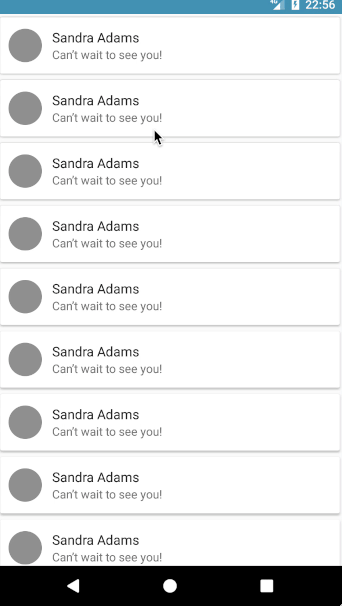

# Typewriter

[]()

 

## Usage

Add to your root build.gradle:
```Groovy
allprojects {
	repositories {
	  ...
	  maven { url "https://jitpack.io" }
	}
}
```

Add the dependency:
```Groovy
dependencies {
    compile 'com.github.Ilya-Gh:Typewriter:v1.0.0'
}
```

## Supported Views

* RecyclerView
* ListView
* ScrollView
* NestedScrollView

## How do I get set up?

Just wrap your view:

```xml
<com.github.ilyagh.TypewriterRefreshLayout
    android:id="@+id/pullToRefresh"
    android:layout_width="match_parent"
    android:layout_height="match_parent">

    <android.support.v7.widget.RecyclerView
        android:id="@+id/recyclerView"
        android:layout_width="match_parent"
        android:layout_height="match_parent"
        android:divider="@null"
        android:dividerHeight="0dp"
        android:fadingEdge="none" />

</com.github.ilyagh.TypewriterRefreshLayout>

```

## Animation

Just implement PullToRefreshView.OnRefreshListener:

```Java
pullToRefresh.setOnRefreshListener(new TypewriterRefreshLayout.OnRefreshListener() {
    @Override
    public void onRefresh() {
        //refresh your data here  
    }
});
```

To start or stop animation: 

`pullToRefresh.setRefreshing(isRefreshing)` 


## Contacts

Email: ilya.ghirici@gmail.com 
<br> Twitter: https://twitter.com/Ilya_ghr

## License

	The MIT License (MIT)

	Copyright © 2017 Ilie Ghirici

	Permission is hereby granted, free of charge, to any person obtaining a copy
	of this software and associated documentation files (the "Software"), to deal
	in the Software without restriction, including without limitation the rights
	to use, copy, modify, merge, publish, distribute, sublicense, and/or sell
	copies of the Software, and to permit persons to whom the Software is
	furnished to do so, subject to the following conditions:

	The above copyright notice and this permission notice shall be included in
	all copies or substantial portions of the Software.

	THE SOFTWARE IS PROVIDED "AS IS", WITHOUT WARRANTY OF ANY KIND, EXPRESS OR
	IMPLIED, INCLUDING BUT NOT LIMITED TO THE WARRANTIES OF MERCHANTABILITY,
	FITNESS FOR A PARTICULAR PURPOSE AND NONINFRINGEMENT. IN NO EVENT SHALL THE
	AUTHORS OR COPYRIGHT HOLDERS BE LIABLE FOR ANY CLAIM, DAMAGES OR OTHER
	LIABILITY, WHETHER IN AN ACTION OF CONTRACT, TORT OR OTHERWISE, ARISING FROM,
	OUT OF OR IN CONNECTION WITH THE SOFTWARE OR THE USE OR OTHER DEALINGS IN
	THE SOFTWARE.

